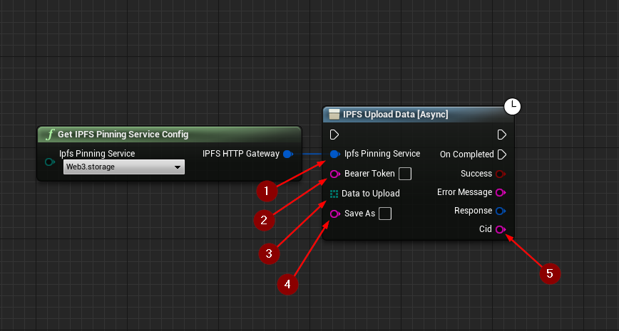

import {Step} from '@site/src/lib/utils.mdx'

## Upload File Function

`IPFS Upload File` Uploads a local file to the *IPFS* network. This function requires inputs as follows:

* Ipfs Pinning Service <Step text="1"/> : Struct, holds the url and name of the pinning service to send the request to.
* Bearer Token <Step text="2"/> : The API token for authentication.
* File To Upload <Step text="3"/> : The path of the file to upload.
* Save As <Step text="4"/> : Optional alternate filename for the uploaded file on IPFS.
If left empty, the original filename will be used.

The returned *Response* is a struct that holds data such as headers, status code, and body of the response of the HTTP
request.

:::info
If *Success* is *True* that only means the upload to the *IPFS* network was successful.
:::

If successful, returns the *CID* <Step text="5"/> of the uploaded file in *String* format.

