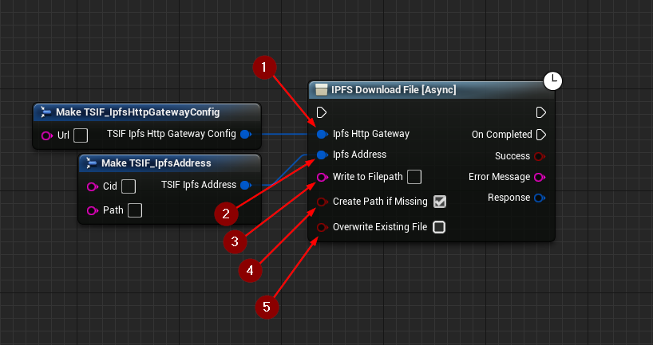

import {Step} from '@site/src/lib/utils.mdx'

## Download File Function

`IPFS Download File` Downloads a file from the *IPFS* network for the specified CID/Path. This function requires
inputs as follows:

* Ipfs Http Gateway <Step text="1"/> : Struct, holds the url of the gateway to send the request to.
* Ipfs Address <Step text="2"/> : Struct, holds the CID and path of the file on *IPFS* network.
* Write To File path <Step text="3"/> : The filepath where the downloaded data is written to.
* Create Path If Missing <Step text="4"/> : Creates the filepath to where the downloaded data should be written to
if it is missing.
* Overwrite Existing File <Step text="5"/> : If set to false and the file exists this function will abort with failure.
Otherwise, an existing file will be overwritten.

The returned *Response* is a struct that holds data such as headers, status code, and body of the response of the HTTP
request.

:::info
If *Success* is *True* that means that the response from the *IPFS* network was successful and writing file to disk to
the specified path was also successful.
:::

