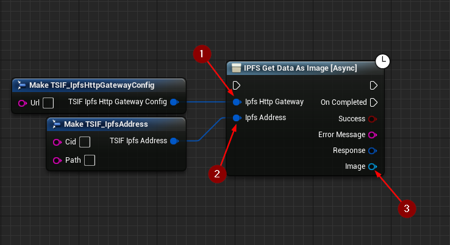

import {Step} from '@site/src/lib/utils.mdx'

## Get Data As Image Function

`IPFS Get Data As Image` Gets data as image from the *IPFS* network for the specified CID/Path. This function requires
inputs as follows:

* Ipfs Http Gateway <Step text="1"/> : Struct, holds the url of the gateway to send the request to.
* Ipfs Address <Step text="2"/> : Struct, holds the CID and path of the file on *IPFS* network.

The returned *Response* is a struct that holds data such as headers, status code, and body of the response of the HTTP
request.

:::info
If *Success* is *True* that only means that the response from the *IPFS* network was successful only.
:::

If successful, returns the *Image* <Step text="3"/> in *Texture 2D* object reference.

