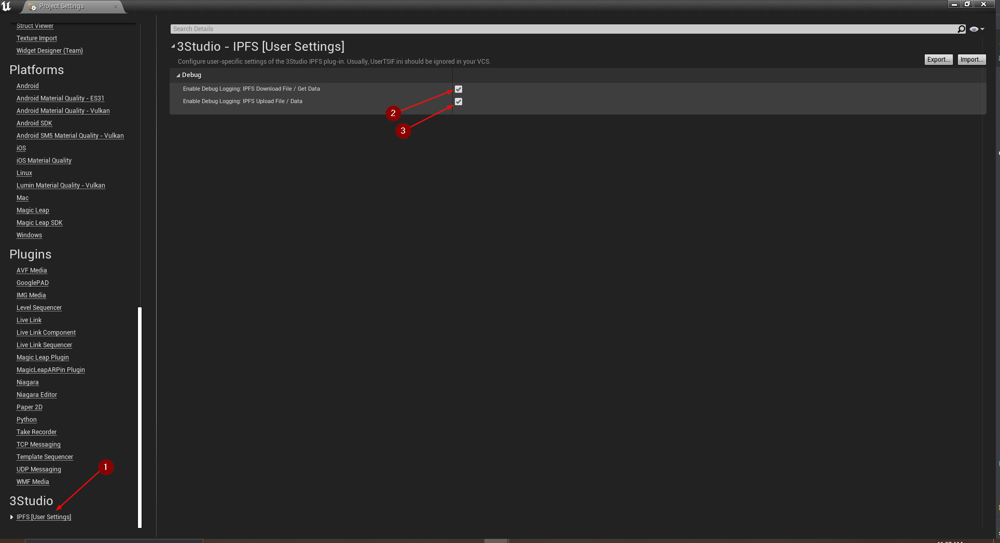

import {Step} from '@site/src/lib/utils.mdx'

## Debug IPFS Network Communication

Sometimes it is helpful being able to take a look at the data sent and received through Http requests to IPFS network.
This debugging feature can be enabled by going to `Edit | Project Settings | 3Studio | IPFS [User Settings]` <Step text="1"/>.

You can select what is the data you want to be printed in the log when sending requests to IPFS, such as:

 * <Step text="2"/> enables debug logging for IPFS Download File or Get Data functions.
 * <Step text="3"/> enables debug logging for IPFS Upload File or Data functions.

This will help you visualize the data in the *requests* sent to `IPFS` network and the *responses* that you will get
back from it. Also, all errors will be logged if something wrong happened during the process.

