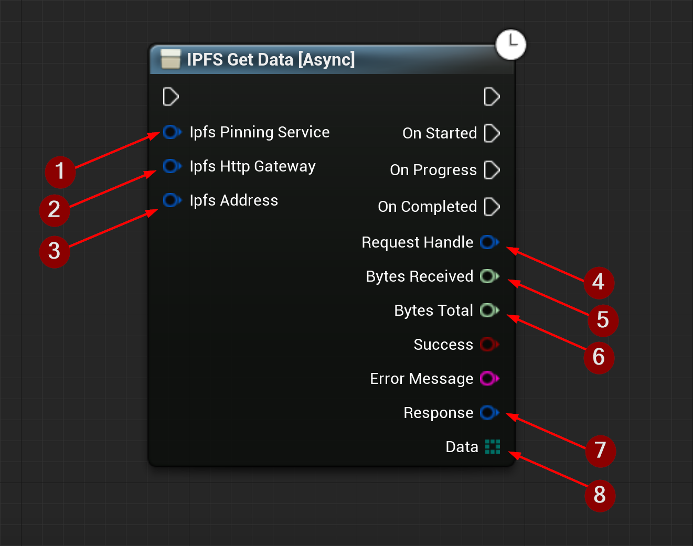

import {Step} from '@site/src/lib/utils.mdx'

## Get Data

`IPFS Get Data` Gets data from the IPFS network for the specified CID/Path. This function requires inputs as follows:

* Ipfs Pinning Service <Step text="1"/> : Struct, holds the url and name of the pinning service the data was pinned to.
It can be left empty, but total number of bytes will not be known.
* Ipfs Http Gateway <Step text="2"/> : Struct, holds the url of the gateway to send the request to.
* Ipfs Address <Step text="3"/> : Struct, holds the CID and path of the file on *IPFS* network.

:::info
If *Success* is *True* that only means that the response from the *IPFS* network was successful only.
:::

If successful returns outputs as follows:
* Request Handle <Step text="4"/> : Handle to a HTTP request, allows for cancellation of an ongoing request.
* Bytes Received <Step text="5"/> : Number of bytes received while the request is still ongoing.
* Bytes Total <Step text="6"/> : Total bytes expected to receive.
* Response <Step text="7"/> : Struct, holds data such as headers, status code, and body of the response of the HTTP
request.
* Data <Step text="8"/> : Data returned from the *IPFS* network as an array of bytes.