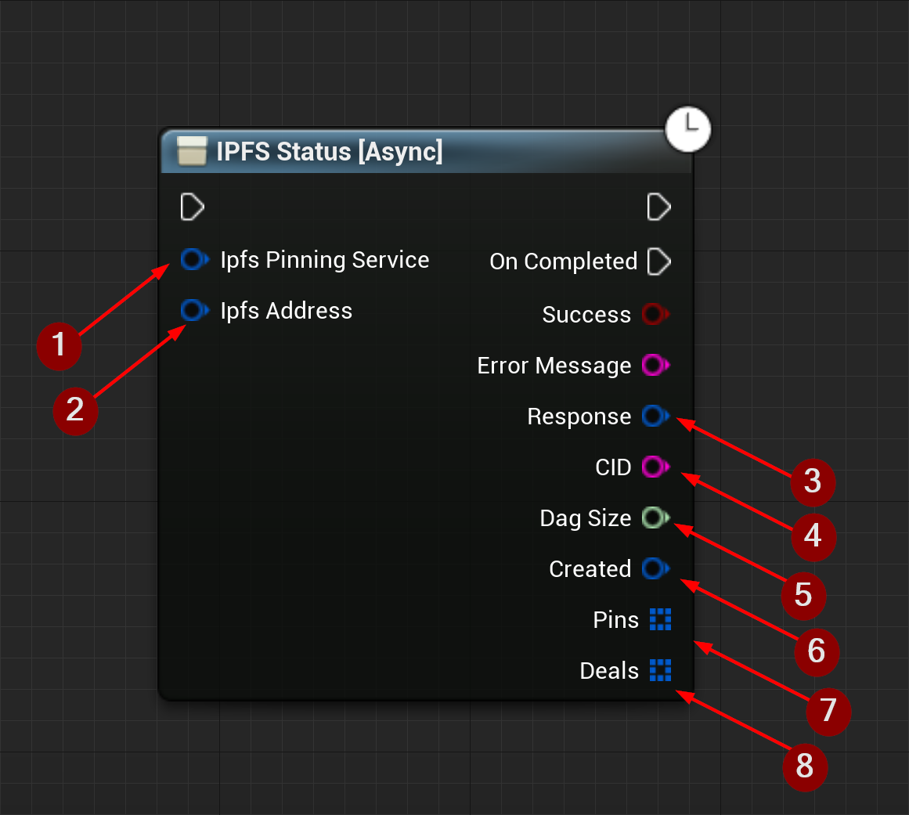

import {Step} from '@site/src/lib/utils.mdx'

##  IPFS Status Function

`IPFS Status` Gets status from the *IPFS* network for the specified CID/Path. This function requires inputs as follows:

* Ipfs Pinning Service <Step text="1"/> : Struct, holds the url and name of the pinning service to send the request to.
* Ipfs Address <Step text="2"/> : Struct, holds the CID and path of the file on *IPFS* network.
* Response <Step text="3"/> : Struct, holds data such as headers, status code, and body of the response of the HTTP
request.
* CID <Step text="4"/> : The *CID* of the uploaded data.
* Dag Size <Step text="5"/> : Total size of the DAG in bytes.
* Created <Step text="5"/> : This is a timestamp in ISO 8601 format: YYYY-MM-DDTHH:MM:SSZ for the *CID* creation.
* Pins <Step text="5"/> : Array of structs that holds info for an IPFS Pin.
* Deals <Step text="5"/> : Array of structs that holds info for an IPFS Deal.

:::info
If *Success* is *True* that only means the upload to the *IPFS* network was successful.
:::

