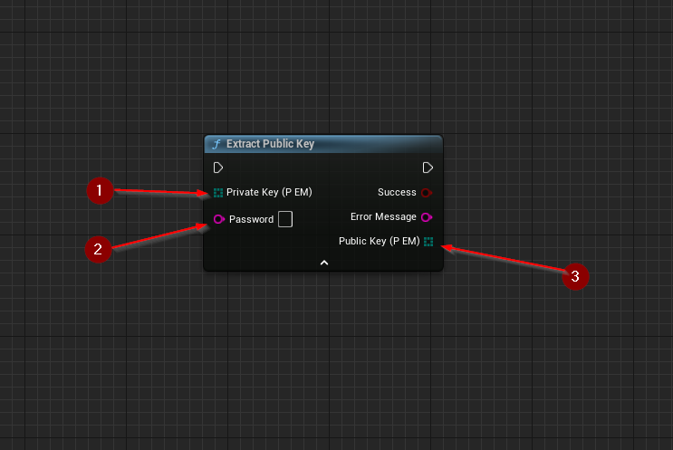

import {Step} from '@site/src/lib/utils.mdx'

`Extract Public Key` Retrieves the public key associated with a given private key. This function requires inputs as follows:

* `Private Key (PEM)` <Step text="1"/> : Byte array, private key bytes encoded as `PEM`.
* `Password` <Step text="2"/> : UTF-8 String, pass-phrase used to decrypt the private key
(should stay empty if the key is not encrypted).

If successful, returns a byte array containing the associated *public key* <Step text="3"/>.