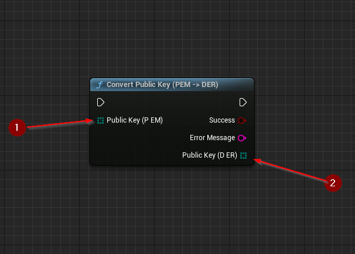
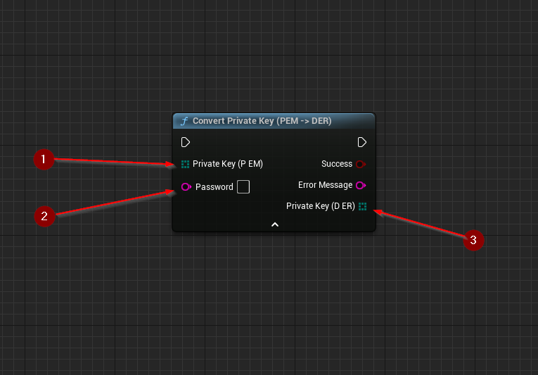

import {Step} from '@site/src/lib/utils.mdx'

Various cryptographic key conversions are available as functions.
Separate functions convert *public* and *private* keys between different encodings.
Available encodings are:

* `PEM`
* `DER`
* `EC`

:::warning
Elliptic Curve encoding only works with Elliptic Curve keys, using another key type will fail.
:::

## Examples
### Convert Public Key

`Convert Public Key` converts a public key from one encoding into another. This function requires inputs as follows:

* `Public Key` <Step text="1"/> : Byte array, public key encoded in the same encoding algorithm as the source.

If successful, returns byte array containing the *public key* <Step text="3"/> in target encoding.

:::note
For Elliptic Curve type keys there's an additional input or output (depending on the conversion direction)
containing the *Elliptic Curve Key Type*.
:::

### Convert Private Key

`Convert Private Key` converts a private key from one encoding into another. This function requires inputs as follows:

* `Private Key` <Step text="1"/> : Byte array, private key encoded in the same encoding algorithm as the source.

There is also an additional optional input:

* `Password` <Step text="2"/> : String, pass-phrase used to decrypt the private key
(Leave empty if key is not encrypted).

If successful, returns byte array containing the *private key* <Step text="3"/> in target encoding.

:::note
For Elliptic Curve type keys there's an additional input or output (depending on the conversion direction)
containing the *Elliptic Curve Key Type*.
:::