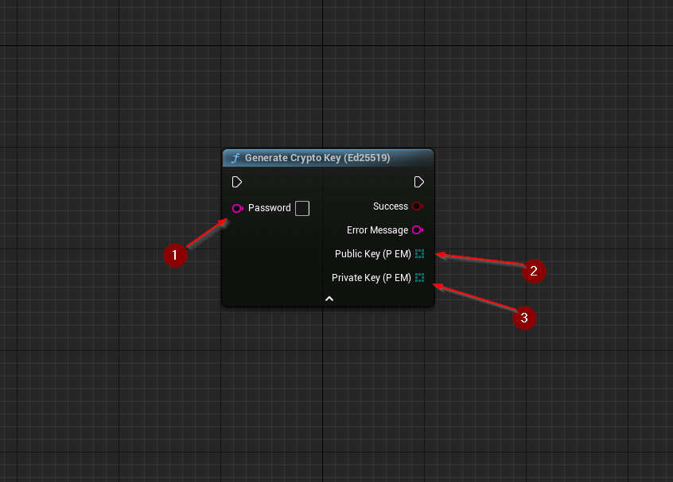
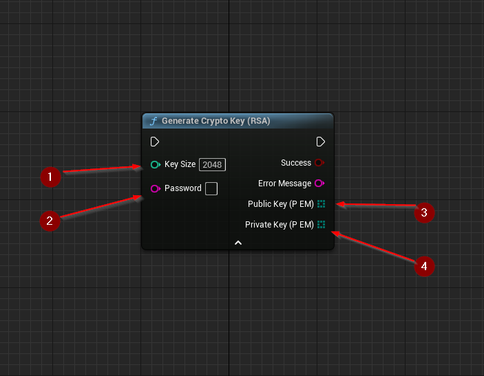

import {Step} from '@site/src/lib/utils.mdx'

Specific cryptographic key generation algorithms are available with the plugin,
harnessing the `OpenSSL` implementation included in *Unreal Engine*'s codebase.

## Ed25519

`Generate Crypto Key (Ed25519)` Generates a new `Ed25519` keypair. This function requires no inputs, however
there is an optional input for `Password` <Step text="1"/>. The password used for private key encryption is encoded as UTF8.
Leaving the `Password` field empty (which is the default behavior), will leave the key unencrypted.

If successful, returns two byte arrays containing the generated *public* <Step text="2"/> and *private* <Step text="3"/> keys encoded as `PEM`.

## RSA

`Generate Crypto Key (RSA)` Generates a new `RSA` keypair. This function requires no inputs,
however there are two optional inputs:

* `Key Size` <Step text="1"/> : Integer, size of the `RSA` key (Set to 2048 by default).
* `Password` <Step text="2"/> : UTF-8 String, a pass-phrase used to encrypt the generated key.

Leaving the `Password` field empty (which is the default behavior), will leave the key unencrypted.

If successful, returns two byte arrays containing the generated *public* <Step text="3"/> and *private* <Step text="4"/> keys encoded as `PEM`.