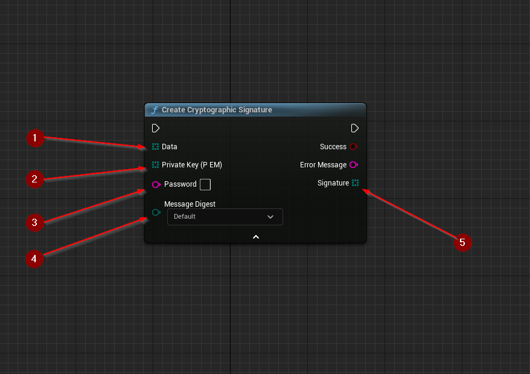
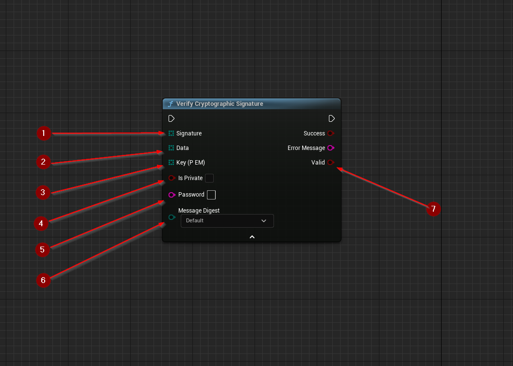

import {Step} from '@site/src/lib/utils.mdx'

## Signing

`Create Cryptographic Signature` Signs data using a cryptographic key. This function requires inputs as follows:

* `Data` <Step text="1"/> : Byte array, data that will be signed.
* `Private Key (PEM)` <Step text="2"/> : Byte array, private key bytes encoded as `PEM`.

There is also two additional optional inputs:

* `Password` <Step text="3"/> : String, pass-phrase used to decrypt the private key (Leave empty if key is not encrypted).
* `Message Digest` <Step text="4"/> : Enumeration, the digest algorithm used in the process of signing.
`Default` will use the default algorithm associated with the key type.

If successful, returns byte array containing the calculated *signature* <Step text="5"/>.

## Verifying

`Verify Cryptographic Signature` Verifies a cryptographic signature against the data that was signed.
This function requires inputs as follows:

* `Signature` <Step text="1"/> : Byte array, the signature bytes that will be verified.
* `Data` <Step text="2"/> : Byte array, data that was signed with.
* `Key (PEM)` <Step text="3"/> : Byte array, key bytes encoded as `PEM`
(By default, verification keys are expected to be public).

There is also three additional optional inputs:

* `Is Private` <Step text="4"/> : Boolean, if true, `Key (PEM)` will be treated as a private key.
* `Password` <Step text="5"/> : String, pass-phrase used to decrypt the private key
(Leave empty if key is not encrypted, or not using a private key).
* `Message Digest` <Step text="6"/> : Enumeration, the digest algorithm used in the process of signing.
`Default` will use the default algorithm associated with the key type.

If successful, returns a boolean value that indicates whether the *signature* <Step text="1"/> is *valid* <Step text="7"/>.
