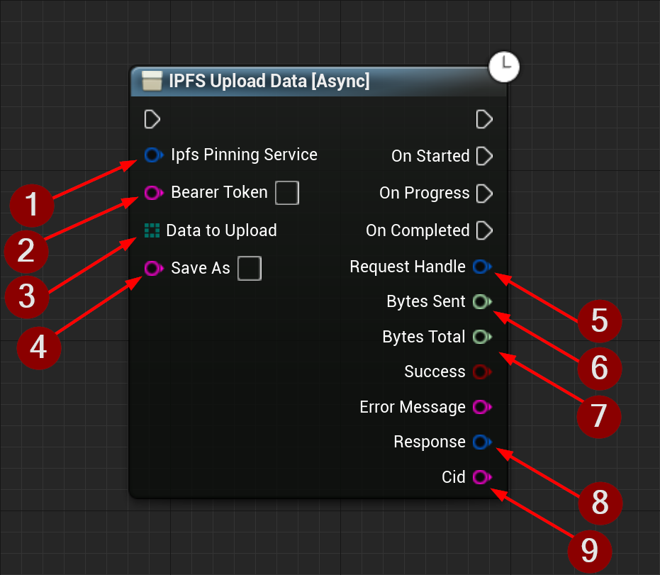

import {Step} from '@site/src/lib/utils.mdx'

## Upload Data Function

`IPFS Upload Data` Uploads data to the *IPFS* network. This function requires inputs as follows:

* Ipfs Pinning Service <Step text="1"/> : Struct, holds the url and name of the pinning service to send the request to.
* Bearer Token <Step text="2"/> : The API token for authentication.
* Data To Upload <Step text="3"/> : The data to upload(as an array of bytes).
* Save As <Step text="4"/> : Mandatory filename for the uploaded data on IPFS.

:::info
If *Success* is *True* that only means the upload to the *IPFS* network was successful.
:::

If successful returns outputs as follows:
* Request Handle <Step text="5"/> : Handle to a HTTP request, allows for cancellation of an ongoing request.
* Bytes Sent <Step text="6"/> : Number of bytes sent while the request is still ongoing.
* Bytes Total <Step text="7"/> : Total bytes expected to receive.
* Response <Step text="8"/> : Struct, holds data such as headers, status code, and body of the response of the HTTP
request.
* CID <Step text="9"/> : The *CID* of the uploaded data.