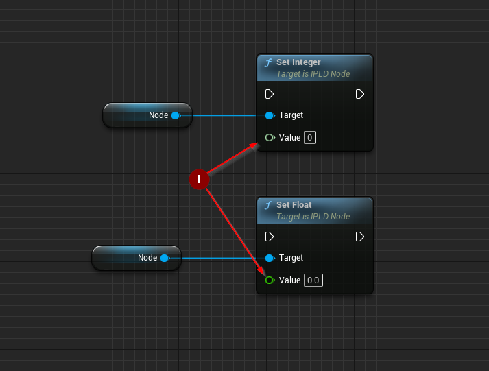
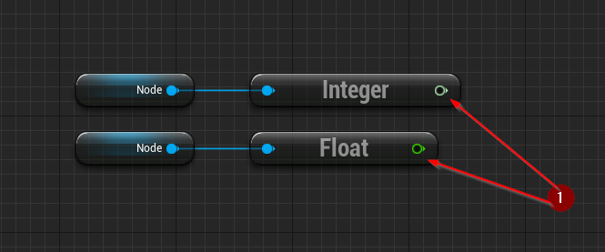
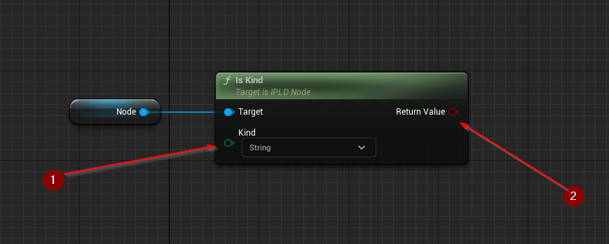

import {Step} from '@site/src/lib/utils.mdx'

## Setting

IPLD node value can be *Set* using a `Set` function corresponding to the desired kind.
All `Set` functions assign a new *value* <Step text="1"/> to the node and, if applicable, change its kind.

## Getting

IPLD node value can be *Gotten* using a `Get` function corresponding to its kind.
All `Get` functions return the *value* <Step text="1"/> assigned to the node.

:::warning
All `Get` functions should be called only on specific IPLD node kinds
(e.g. `Get Boolean` should only be called on a Boolean node). Kind can be checked using [Kind Functions](#kind).
:::

## Kind

### Get Kind

IPLD node kind can be *Gotten* using the `Get Kind` property getter, that returns an *enum value* <Step text="1"/>
containing the kind of the node.

### Is Kind

IPLD node kind can be *Checked* using the `Is Kind` function. This function requires inputs as follows:

* `Node` <Step text="1"/> : IPLD Node Object, the IPLD node object which will have its kind checked.
* `Kind` <Step text="2"/> : Enum, the kind that will be compared to the node's kind.

This function returns a *boolean value* <Step text="3"/>,
if node kind was the same as the query the value will be `true`, otherwise `false`.