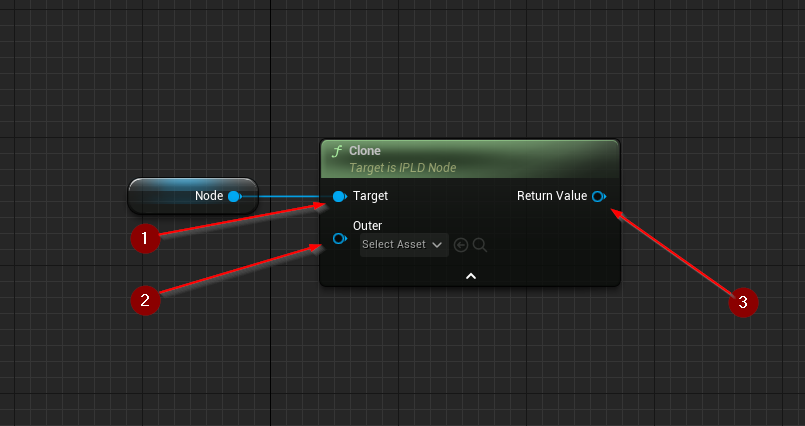
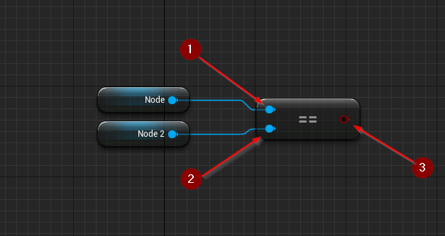

import {Step} from '@site/src/lib/utils.mdx'

## Clone

`Clone` function creates a duplicate of an IPLD node.
This is a deep copy, meaning all nested nodes will also have `Clone` called on them.
This function requires inputs as follows:

* `Node` <Step text="1"/> : IPLD Node Object, the node to be cloned.

There is also an additional optional input:

* `Outer` <Step text="2"/> : Object, the outer object of the node (since nodes are objects themselves).
Leaving this empty will result in a transient object.

This function returns a new *IPLD Node object* <Step text="3"/>
with its kind and value set to the kind and value of the original.

## Is Equal

`Is Equal` function compares one IPLD Node <Step text="1"/> to another <Step text="2"/>.

This function returns a *boolean value* <Step text="3"/>,
if node kind and value was the same as the query's the value will be `true`, otherwise `false`.