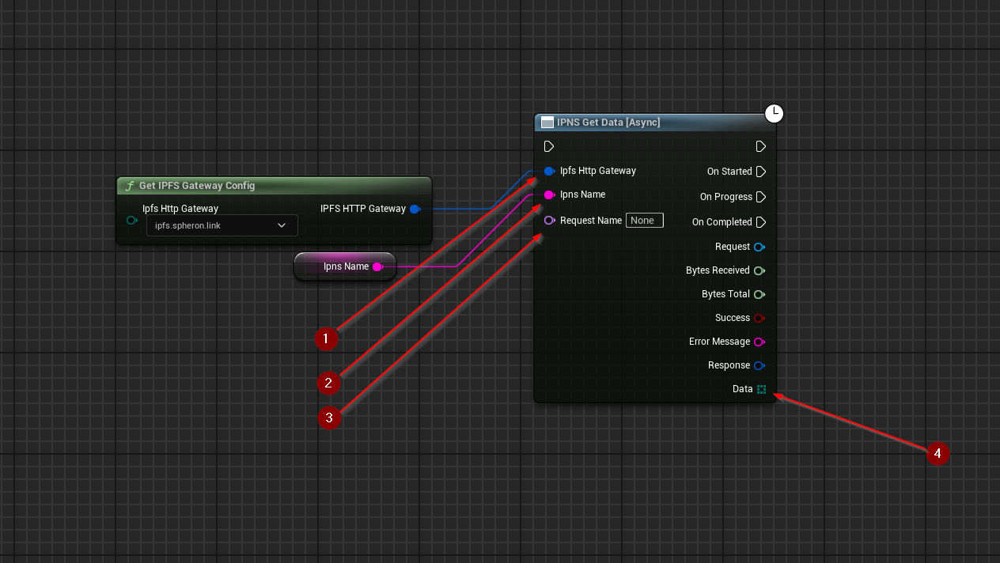

import {Step} from '@site/src/lib/utils.mdx'

## Get Data

`IPNS Get Data` Gets data from the IPFS network for the specified IPNS name. This function requires inputs as follows:

* `Ipfs Http Gateway` <Step text="1"/> : Struct, holds the url of the gateway to send the request to.
* `Ipns Name` <Step text="2"/> : UTF-8 String, holds the **IPNS name** used to resolve the requested data.

There's also an optional input `Request Name` <Step text="3"/>, a unique identifier for the plugin's HTTP subsystem. It
allows to fetch the request by name. This is purely optional and only changes how the HTTP request will be managed
internally by the plugin.

The returned *Response* is a struct that holds data such as headers, status code, and body of the response of the HTTP
request.

:::info
If *Success* is *True* that only means that the response from the *IPFS* network was successful only.
:::

If successful, returns the *Data* <Step text="4"/> which is an array of bytes.
