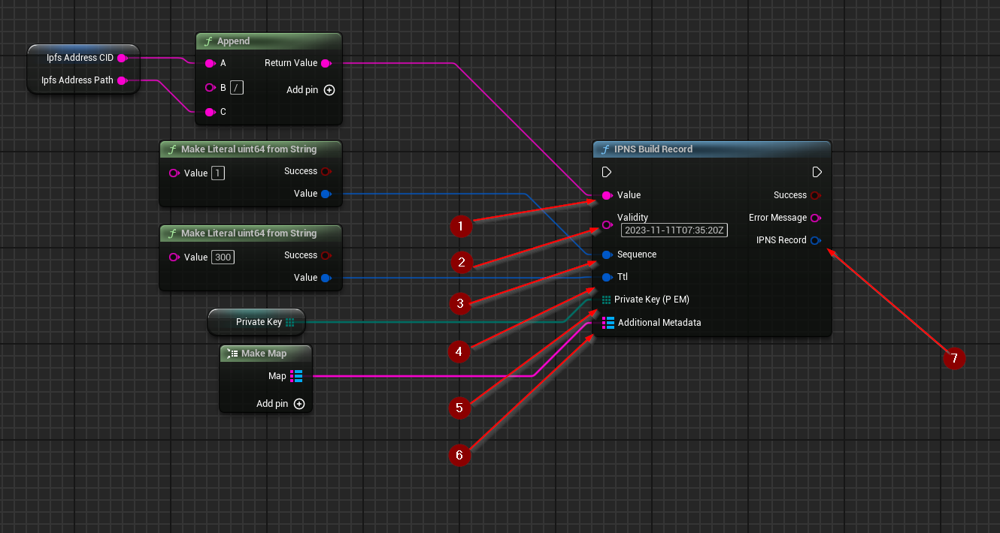

import {Step} from '@site/src/lib/utils.mdx'

## Build Record
`IPNS Build Record` Builds a new record from provided data and signs it. This function requires inputs as follows:

* `Value` <Step text="1"/> : UTF-8 String, the actual value pointed to by the name. Usually an IPFS CID or another IPNS name.
* `Validity` <Step text="2"/> : UTF-8 String, How long the IPNS name is valid. This can be updated when the record is republished.
* `Sequence` <Step text="3"/> : uint64, The iteration this record is on. Starts at 1 with the first publishing and increases by 1 with every republish.
* `Ttl` <Step text="4"/> : uint64, this is a DNS-related term better explained
[here](https://en.wikipedia.org/wiki/Time_to_live). The default value is 300 (5 minutes).
* `Private Key (PEM)` <Step text="5"/> : Byte array, they private key used to sign the record in `PEM` encoding.
* `Additional Metadata` <Step text="6"/> : String to IPLD Node object map, additional metadata that can be attached to
the record. The keys should be prefixed with underscore '_' symbol, but it is not enforced.

:::warning
Record maximum size is 10KiB. Additional Metadata should not contain large values.
:::

If successful, returns the *IPNS Record* <Step text="7"/> which is the signed data structure, ready for publishing.
