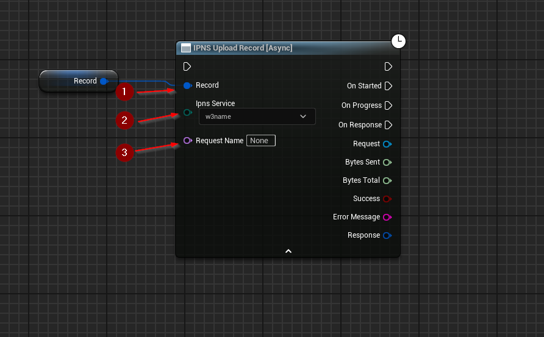

import {Step} from '@site/src/lib/utils.mdx'

## Upload Record
`IPNS Upload Record` Uploads a record to the IPFS ecosystem through a pinning service. This function requires inputs
as follows:

* `Record` <Step text="1"/> : Record structure, signed record to be uploaded.
* `Ipns Service` <Step text="2"/> : Enum, the pinning service to send the record to.

There's also an optional input `Request Name` <Step text="3"/>, a unique identifier for the plugin's HTTP subsystem. It
allows to fetch the request by name. This is purely optional and only changes how the HTTP request will be managed
internally by the plugin.

The returned *Response* is a struct that holds data such as headers, status code, and body of the response of the HTTP
request.

:::info
If *Success* is *True* that only means that the response from the *IPFS* network was successful only.
:::