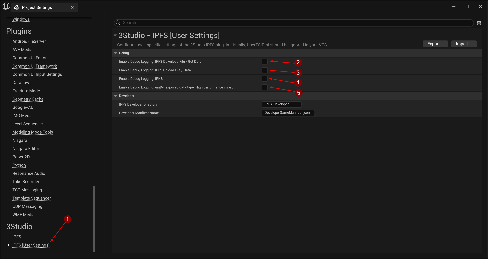

import {Step} from '@site/src/lib/utils.mdx'

## Debug Settings

It is beneficial to examine the data we are interacting with, including the information transmitted via HTTP requests to
IPFS and IPNS networks. Additionally, understanding the exposed *uint64* values in Blueprints provides valuable insights.
These debugging features can be enabled by going to `Edit | Project Settings | 3Studio | IPFS [User Settings]` <Step text="1"/>.

## Debug IPFS Network Communication

You can select what is the data you want to be printed in the log when sending requests to IPFS, such as:

 * <Step text="2"/> Enables debug logging for IPFS Download File or Get Data functions.
 * <Step text="3"/> Enables debug logging for IPFS Upload File or Data functions.

This will help you visualize the data in the *requests* sent to `IPFS` network and the *responses* that you will get
back from it. Also, all errors will be logged if something wrong happened during the process.

## Debug IPNS Network Communication

 * <Step text="4"/> Enables debug logging for all IPNS functions.

This will help you visualize the data in the *requests* sent to `IPNS` network and the *responses* that you will get
back from it. Also, all errors will be logged if something wrong happened during the process.

## Debug uint64 data type

 * <Step text="5"/> Enable Debug Logging for the exposed *uint64* data type.

This will help you to visualize the value of the exposed *uint64* data type while debugging in the editor.

