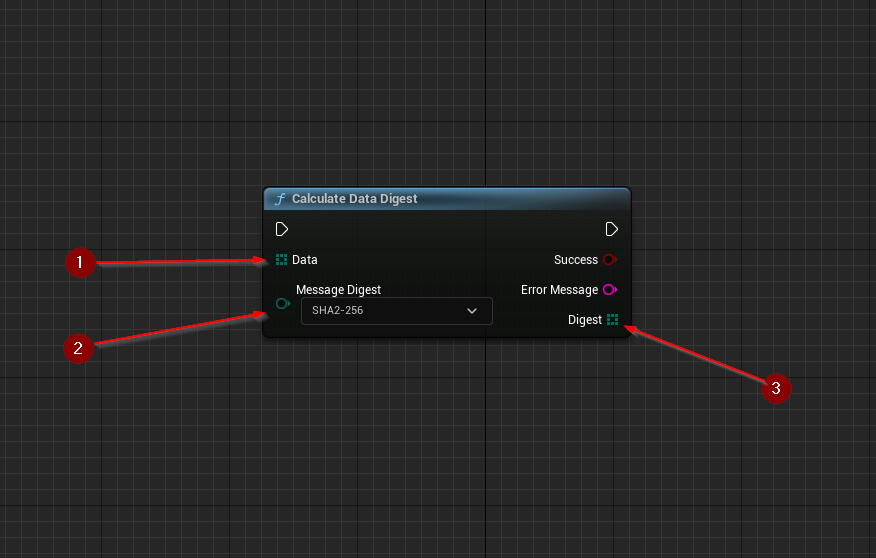

import {Step} from '@site/src/lib/utils.mdx'

`Calculate Data Digest` Calculates the specific digest of a byte array. This function requires inputs as follows:

* `Data` <Step text="1"/> : Byte array, data for which digest will be calculated.
* `Message Digest` <Step text="2"/> : Enumeration, type of digest algorithm used in digest calculation.

If successful, returns a byte array containing the calculated *digest* <Step text="3"/>.