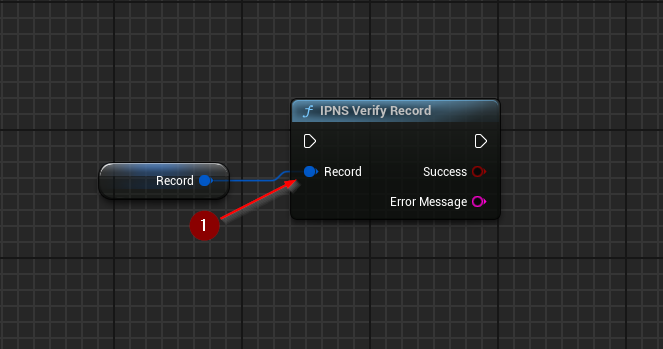

import {Step} from '@site/src/lib/utils.mdx'

## Verify Record
`IPNS Verify Record` Verifies the validity of a given record structure. This function requires inputs as follows:

* `Record` <Step text="1"/> : Record structure, record to be verified.

