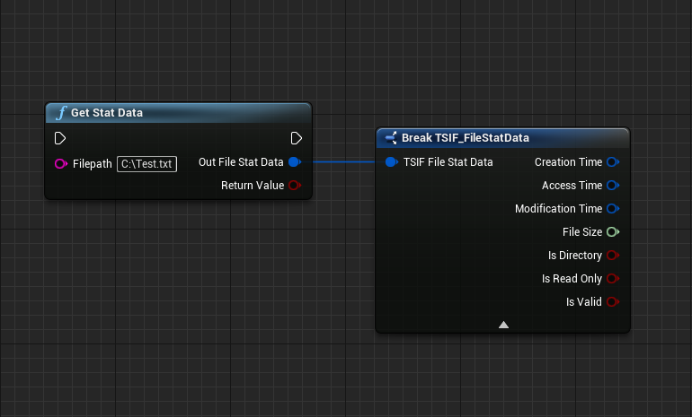

import {Step} from '@site/src/lib/utils.mdx'

## Get Stat Data Function

`Get Stat Data` is a helper function where you provide a file or directory to get useful information about it such as:

 * Creation Time.
 * Access Time.
 * Modification Time.
 * File Size.
 * Is Directory.
 * Is Read Only.
 * Is Valid.

