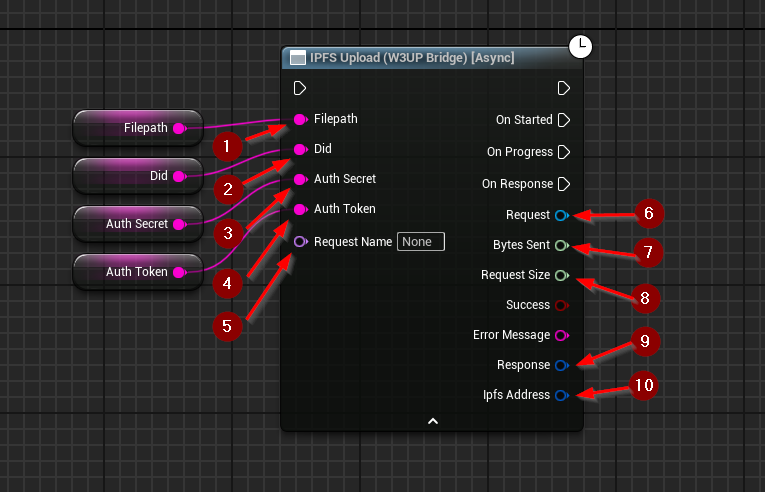

import {Step} from '@site/src/lib/utils.mdx'

## Upload (W3UP Bridge) Function

`IPFS Upload (W3UP Bridge)` Uploads a local file or directory to the *IPFS* network using the web3.storage W3UP Bridge. This function requires inputs as follows:

* Path <Step text="1"/> : Local path to the file or directory to upload.
* DID <Step text="2"/> : The DID used in authorization obtained from Web3.Storage.
* AuthSecret <Step text="3"/> : The authorization secret. Can be generated using w3 cli as 'X-Auth-Secret'.
* AuthToken <Step text="4"/> : The authorization token. Actually a JWT-encoded UCAN. Can be generated using w3 cli as 'Authorization'.

:::info
**AuthSecret** and **AuthToken** are generated using w3-cli.
This command generates them as **X-Auth-Secret** and **Authorization** respectively: `w3 bridge generate-tokens <DID>`.
More information available in the [official documentation](https://web3.storage/docs/how-to/http-bridge/).
:::

There's also an optional input `Request Name` <Step text="5"/>, a unique identifier for the plugin's HTTP subsystem. It
allows to fetch the request by name. This is purely optional and only changes how the HTTP request will be managed
internally by the plugin.

:::info
If *Success* is *True* that only means the upload to the *IPFS* network was successful.
:::

If successful returns outputs as follows:
* Request <Step text="6"/> : Handle to a HTTP request, allows for cancellation of an ongoing request.
* Bytes Sent <Step text="7"/> : Number of bytes sent while the request is still ongoing.
* Request Size <Step text="8"/> : Total size of the request.
* Response <Step text="9"/> : Struct, holds data such as headers, status code, and body of the response of the HTTP
request.
* IPFS Address <Step text="10"/> : The *CID* of the uploaded data and path to the file if applicable.