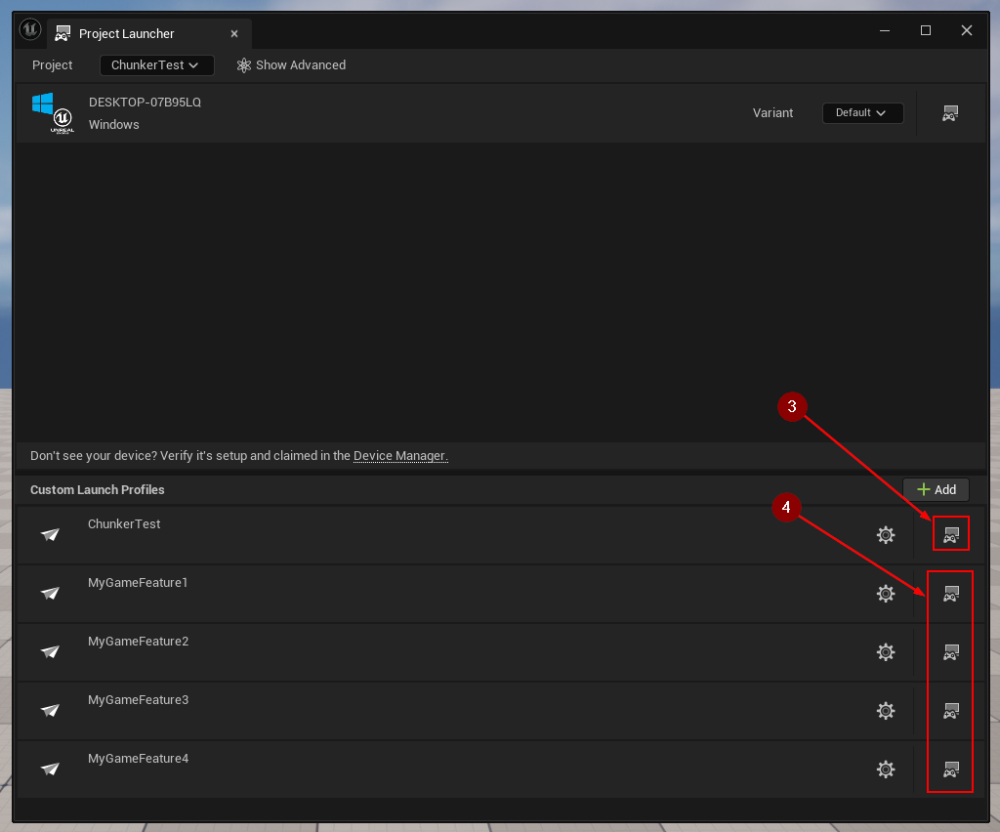

import {Step, Highlight} from '@site/src/lib/utils.mdx'

## Prepare Game Features for building

* If you have IPFS plugin enabled in your project, the Chunker Manifest Manager icon will appear next to "play" button.

* After clicking on it, you will see the Chunker Manifest Manager home page. Here you can read about each `tab` <Step text="1"/> or clink on one of the buttons
to visit `documentation page` <Step text="2"/>, `YouTube tutorials` <Step text="3"/> or join our `Discord server` <Step text="4"/>.
* To start using Chunker Manifest Manager go to next page by clicking `Version` <Step text="5"/>.

### Create Project Profile

* First create project profile by clicking `Create` in the Project section.

* Most likely after that you will see the message "Missing cooked maps.". To fix that, go to `Tools` <Step text="1"/> menu, then click `Project Launcher` <Step text="2"/>.
In opened menu you can find `Custom Launch Profiles` where will be listed yours project and plugin profiles. There you need to find your project Profile and click on a gear next to it to edit profile <Step text="3"/>.
Scroll down in your project profile settings to find `Cooked maps` list and select at least one map <Step text="4"/>, that later will be cooked with the project.
Then click `Back` <Step text="5"/> to save changes, close Project Launcher and go back to Chunker Manifest Manager. If you still see the message, click `Revalidate` <Step text="6"/> button and it should disappear.

### "No Game Features available."

If after opening `Version` tab you see this message, make sure your Game Features are enabled.

Open `Edit` <Step text="1"/> menu, then click `Plugins` <Step text="2"/>. It will open the Plugins menu, where you need to select next `Game Features` <Step text="3"/>,
check the box <Step text="4"/> next to your Game Feature(s) to enable them and restart the editor <Step text="5"/>.

After that if you go back to Chunker Manifest Manager, in `Version` tab now you should see the list of available Game Features.

### Create Game Features Profiles

* Now when project profile is prepared, time to create profiles for the Game Features. For that simply select all your Game Features you want to use <Step text="1"/> and click `Create Profile` <Step text="2"/>.
It will automatically create a profile for each of the selected game features.

## Create PAK files

* To build Game Features and generate PAK files go to `Tools` <Step text="1"/> menu, then click `Project Launcher` <Step text="2"/>.
There you will see the list of all Project and Game Features Profiles. Before building Game Features, you need to build your project.
Find your Project Profile and click `Launch` <Step text="3"/> button next to it to build your project. After this process finished, everything is ready for building Game Features.
In the `Project Launcher` find Game Features that you want to build and click `Launch` <Step text="4"/> button next to their names.
It will generate PAK file that you can fund by default under this path: `..\PROJECT_NAME\Plugins\GameFeatures\GAME_FEATURE_NAME\Saved\StagedBuilds\TARGET_PLATFORM\PROJECT_NAME\Plugins\GameFeatures\GAME_FEATURE_NAME\Content\Paks\TARGET_PLATFORM`
It is recommended to copy/move PAK files of your Game Features into one directory, so later all of them can be selected at once for uploading.

## Upload Game Features to IPFS

### IPFS Settings

* To be able to upload Game Features to IPFS first you need you choose to which pinning service yoy want to upload them and set your credentials. To do this, go to `IPFS Settings` <Step text="1"/> tab.
There you can open a dropdown and select pinning service <Step text="2"/> you are using. After that below will appear all required token inputs <Step text="3"/>. Paste there your tokens and everything is ready for uploading Game Features.

### Upload

* Return to `Upload` <Step text="1"/> tab. Click `Select PAK Files...` <Step text="2"/> to open selection window. Go to directory where your PAK files are saved, select one or more of them and click `Open`.
All selected files should appear now here. To start uploading, click button <Step text="3"/> `Upload PAK Files`. This process might take a few minutes, depending on the amount of files, their size and your internet speed.
After they are uploaded you will see their CIDs <Step text="4"/> here and in `Output Log`. You can copy and save you CIDs from here but remember that after files are uploaded to your IPFS storage you can find them there and copy their CIDs from there.

## Construct and upload Manifest to IPNS

### IPNS Settings

* Before working with manifest you need to set a PEM key. Go to `IPNS Settings` <Step text="1"/> tab.
If you already have a PEM key saved as .pem file you can click `Browse...` <Step text="2"/> and select the file.
If you don't have one at all, you can click `Generate PEM Key...` <Step text="3"/> and it will make one for you.
Or you can import already existing PEM key from text by clicking `Import PEM Key from Text...` <Step text="4"/> and pasting it to opened field.

### Construct and upload

* After PEM key is set open `Manifest` <Step text="1"/> tab. There you will see list of all Game Features in this Project.
Select <Step text="2"/> the ones that you would like to include in the manifest and click <Step text="3"/> `Construct Manifest`. This will create `GameManifest.json` under `IPFS Developer Directory` which can be changed in the Project Settings (`IPFS-Developer` by default).
After manifest is constructed click <Step text="4"/> `Upload Manifest` to upload it to IPNS. When it is done, manifest's CID and IPNS name will appear as notification on a screen and in the output log.

## Project update pipeline

* Although this is possible to use Manifest Manager's functionality in many different ways, this tool is build with the idea of specific game update pipeline.
By following this pipeline you can ensure the most effectiveness of this tool.

### Versioning

* After changes were made in your Project and/or Game Features, and it's ready for an update, first step is to update Project version.
Even if changes were made only in one of the Game Features, it should still be represented in Project Version.
Then in case if changes were made in one or more Game Features, set their version to new Project version. Do not apply new version to Game Features that didn't get updated.
It's crucial to update the project version even if only a single game feature has been modified, as this ensures consistency and clarity in the development process.
By using this method you ensure a clear overview of timeline when each of the Game Features was updated.