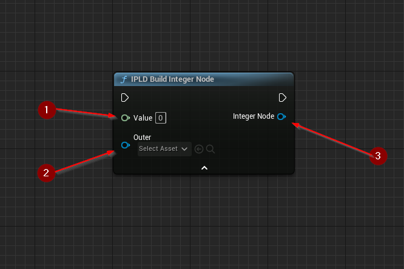

import {Step} from '@site/src/lib/utils.mdx'

`IPLD Build Node` functions create an `IPLD` node of a specific [`Kind`](https://ipld.io/docs/schemas/features/typekinds/#data-model-kinds).
These functions require inputs as follows:

* `Value` <Step text="1"/> : Variable (Kind Dependant), the initial value of the node.

There is also an additional optional input:

* `Outer` <Step text="2"/> : Object, the outer object of the node (since nodes are objects themselves).
Leaving this empty will result in a transient object.

The output is an IPLD *node* <Step text="3"/> object created using the specified value.