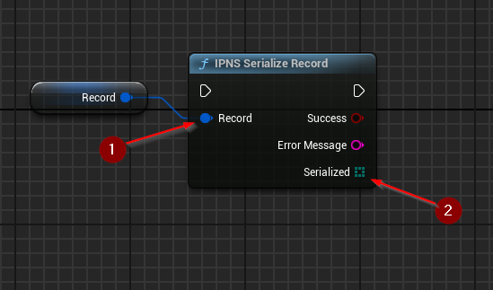

import {Step} from '@site/src/lib/utils.mdx'

## Serialize Record
`IPNS Serialize Record` Serializes a given record structure into protobuf-encoded byte array. This function requires
inputs as follows:

* `Record` <Step text="1"/> : Record structure, record to be serialized.

If successful, returns the *Serialized* <Step text="2"/> data, which is an array of bytes.