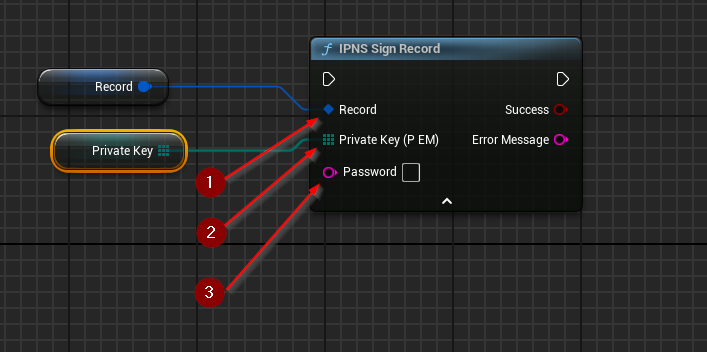

import {Step} from '@site/src/lib/utils.mdx'

## Sign Record
`IPNS Sign Record` Signs an existing IPNS record data structure using a private key. This function requires inputs as follows:

* `Record` <Step text="1"/> : Record structure reference, a mutable reference to the IPNS record instance being signed.
* `Private Key (PEM)` <Step text="2"/> : Byte array, they private key in `PEM` encoding. Used to sign the record.

There's also an optional input `Password` <Step text="3"/> : UTF-8 String, pass-phrase used to decrypt the private key
(should stay empty if the key is not encrypted).

