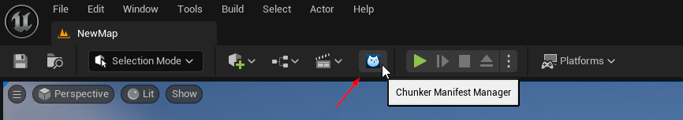
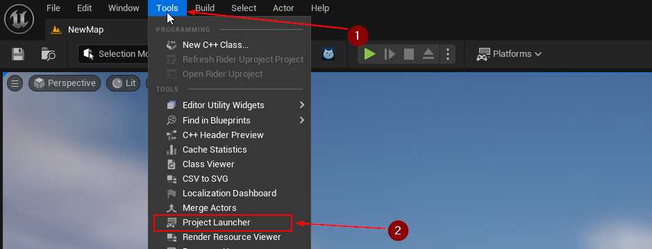
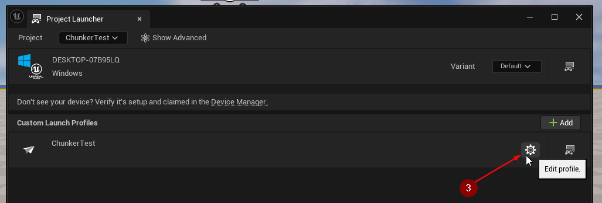
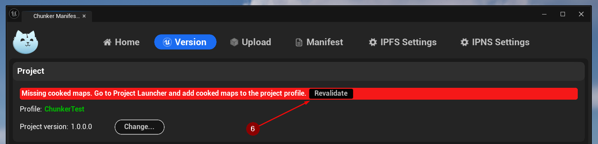
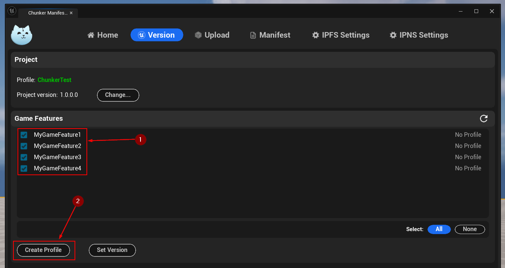
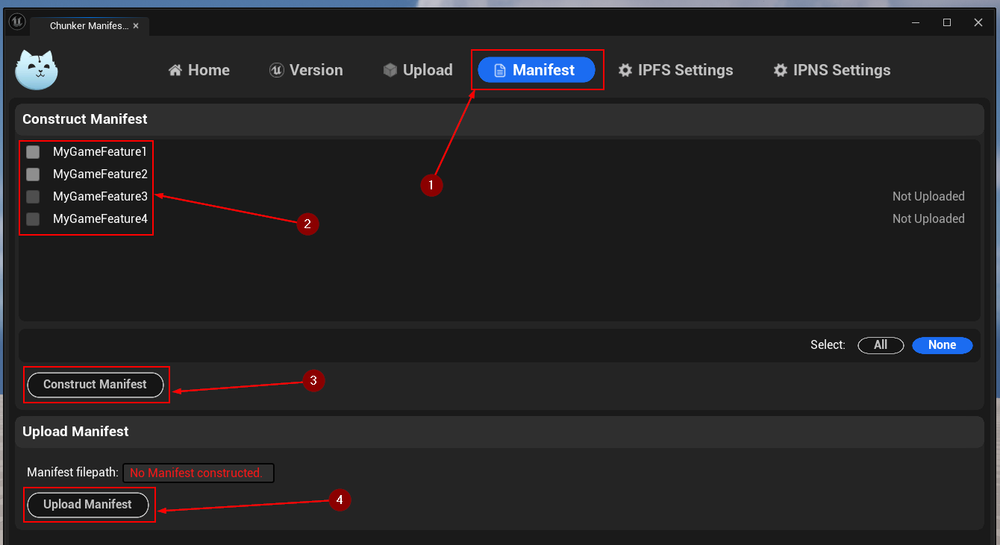

import {Step, Highlight} from '@site/src/lib/utils.mdx'

## Start

After you [installed and enabled](/docs/getting-started/installation) the IPFS
plugin, the **Chunker Manifest Manager** button will appear next to the *Play*
button.

Click on this button to open the **Chunker Manifest Manager** window.

You will be greeted with the *Home* tab which gives you an overview about your
options on each *tab* <Step text="1"/> as well as a convenient way to access the
plugin's `Documentation` <Step text="2"/> and
`YouTube Tutorials` <Step text="3"/>.

If you have questions and need support, please join our
`Discord Server` <Step text="4"/>.

In order to start using **Chunker Manifest Manager**, click on the `Version`
*tab* <Step text="5"/>.

## Step 1: Prepare your Game Project

This workflow makes use of Unreal Engine's built-in
[Project Launcher](https://dev.epicgames.com/documentation/en-us/unreal-engine/using-the-project-launcher-in-unreal-engine)
and its profiles. The **Chunker Manifest Manager** will help you in creating
and setting up those profiles correctly.

### Create Project Profile

First, create a *Project Profile* by clicking `Create` in the *Project* section.

Usually, you will see the message `Missing cooked maps` after creating a new
*Project Profile* which is expected.

### Resolve "Missing cooked maps"

In order to resolve this configuration issue, go to the
`Tools` <Step text="1"/> menu in the *Unreal Engine* editor window and select
`Project Launcher` <Step text="2"/>.

In the *Project Launcher* window, you will find a section labeled
*Custom Launch Profiles*. All your existing *Project* and *Game Feature*
profiles will be displayed here. For now, you should only see one profile which
is the *Project Profile* named after your game project.

Click on the *gear* <Step text="3"/> button next to your *Project Profile* to
edit it.

Next, scroll down within this *Project Profile* until you find a section labeled
`Cooked maps`.

Make sure there is at least one map of your project selected <Step text="4"/>
that will be cooked with the project later.

Then, click on the `Back` <Step text="5"/> button to save your changes and close
the *Project Launcher* window.

When switching back to the *Chunker Manifest Manager* window you may still see
the message about missing cooked maps. Click the `Revalidate` <Step text="6"/>
button to let **Chunker Manifest Manager** check again for any configuration
issues.

The error message should have disappeared now after revalidating.

### Resolve "No Game Features available"

In case you do not have any *Game Features* in your project yet, you will see
the message `No Game Features available` in the *Game Features* section.

You can use the button <Step text="1"/> in the top right corner to refresh this list.

:::note
If your project already uses **Game Features**, you can skip this section and
continue with [Step 2](#step-2-prepare-your-game-features).
:::

:::danger Important
To make use of **Chunker Manifest Manager**, you need to have at least one
*Game Feature* in your game project and at least one of them needs to be
*enabled*.

Follow the
[official documentation](https://dev.epicgames.com/documentation/en-us/unreal-engine/game-features-and-modular-gameplay-in-unreal-engine)
to create at least one *Game Feature*.
:::

If you still see this message after opening the *Version* tab, make sure your
*Game Features* are enabled.

Open `Edit` <Step text="1"/> menu, then click `Plugins` <Step text="2"/>.

This will open the *Plugins* window. On the left hand side, select the
`Game Features` <Step text="3"/> category and make sure the
checkbox <Step text="4"/> next to your *Game Feature(s)* are enabled. You may
need to restart the editor <Step text="5"/> afterwards.

## Step 2: Prepare your Game Features

In the `Version` tab of *Chunker Manifest Manager*, you should see a list of
available *Game Features*.

### Create Game Feature Profiles

Now it's time to create profiles for your *Game Features*. Select one or more
*Game Features* <Step text="1"/> and click on the
`Create Profile` <Step text="2"/> button.

## Step 3: Create `.pak` files from *Game Features*

In order to create `.pak` files that can be uploaded later, each *Game Feature*
needs to be built by using the corresponding *Project Launcher* profiles.

In the *Unreal Engine* editor window, go to `Tools` <Step text="1"/> menu and
select `Project Launcher` <Step text="2"/>.

In the *Project Launcher* window you will see a list of all your *Project* and
*Game Features* profiles that you just created.

:::info
Before you can build any of your *Game Features* you need to build your *Game
Project* first.
:::

Find your *Project Profile* and click on its `Launch` <Step text="3"/> button.

After this process has finished, continue with building your *Game Features*.
To do so, find the *Game Features* that you want to build and click on their
`Launch` <Step text="4"/> buttons, one after another.

At this point, you should find one created `.pak` file per *Game Feature*.

Starting from the root directory of your Unreal project, the path to each `.pak`
file can be found as follows:

- `./`<Highlight>`PROJECT_NAME`</Highlight>`/Plugins/GameFeatures`
    - `/`<Highlight>`GAME_FEATURE_NAME`</Highlight>`/Saved/StagedBuilds`
        - `/`<Highlight>`TARGET_PLATFORM`</Highlight>
            - `/`<Highlight>`PROJECT_NAME`</Highlight>`/Plugins/GameFeatures`
                - `/`<Highlight>`GAME_FEATURE_NAME`</Highlight>`/Content/Paks`
                    - `/`<Highlight>`TARGET_PLATFORM`</Highlight>

:::tip
Copy or move `.pak` files of your *Game Features* into one directory, so that
all of them can easily be selected at once for uploading later.
:::

## Step 4: Upload Game Features to IPFS

### IPFS Settings

In order to upload *Game Features* to IPFS, you need to choose a
*Pinning Service* and add your credentials for it in the
`IPFS Settings` <Step text="1"/> tab.

First, select the *Pinning Service* <Step text="2"/> you would like to use.
Depending on the selected service, the inputs below for the required credentials
may change.

In this example, we chose *Web3.Storage* as our *Pinning Service* and have to
provide a *DID*, *Authorization Secret*, and
*Authorization Token* <Step text="3"/>.

:::tip
Credentials are saved per *Pinning Service* so that switching between them is
quick and easy.
:::

### Upload

* Return to `Upload` <Step text="1"/> tab. Click `Select PAK Files...` <Step text="2"/> to open selection window. Go to directory where your PAK files are saved, select one or more of them and click `Open`.
All selected files should appear now here. To start uploading, click button <Step text="3"/> `Upload PAK Files`. This process might take a few minutes, depending on the amount of files, their size and your internet speed.
After they are uploaded you will see their CIDs <Step text="4"/> here and in `Output Log`. You can copy and save you CIDs from here but remember that after files are uploaded to your IPFS storage you can find them there and copy their CIDs from there.

## Construct and upload Manifest to IPNS

### IPNS Settings

* Before working with manifest you need to set a PEM key. Go to `IPNS Settings` <Step text="1"/> tab.
If you already have a PEM key saved as .pem file you can click `Browse...` <Step text="2"/> and select the file.
If you don't have one at all, you can click `Generate PEM Key...` <Step text="3"/> and it will make one for you.
Or you can import already existing PEM key from text by clicking `Import PEM Key from Text...` <Step text="4"/> and pasting it to opened field.

### Construct and upload

* After PEM key is set open `Manifest` <Step text="1"/> tab. There you will see list of all Game Features in this Project.
Select <Step text="2"/> the ones that you would like to include in the manifest and click <Step text="3"/> `Construct Manifest`. This will create `GameManifest.json` under `IPFS Developer Directory` which can be changed in the Project Settings (`IPFS-Developer` by default).
After manifest is constructed click <Step text="4"/> `Upload Manifest` to upload it to IPNS. When it is done, manifest's CID and IPNS name will appear as notification on a screen and in the output log.

## Project update pipeline

* Although this is possible to use Manifest Manager's functionality in many different ways, this tool is build with the idea of specific game update pipeline.
By following this pipeline you can ensure the most effectiveness of this tool.

### Versioning

* After changes were made in your Project and/or Game Features, and it's ready for an update, first step is to update Project version.
Even if changes were made only in one of the Game Features, it should still be represented in Project Version.
Then in case if changes were made in one or more Game Features, set their version to new Project version. Do not apply new version to Game Features that didn't get updated.
It's crucial to update the project version even if only a single game feature has been modified, as this ensures consistency and clarity in the development process.
By using this method you ensure a clear overview of timeline when each of the Game Features was updated.