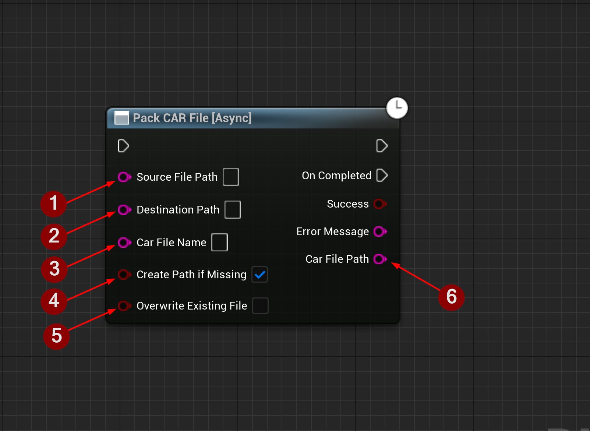

import {Step, Highlight} from '@site/src/lib/utils.mdx'

`Pack CAR File` Packs a file or directory (non-recursively) as a `CAR` file. This function requires inputs as follows:

* `Source File Path` <Step text="1"/> : Path to the source file or directory.
* `Destination Path` <Step text="2"/> : Path to write the `CAR` file to.
* `Car File Name` <Step text="3"/> : Name of the `CAR` file.
* `Create Path If Missing` <Step text="4"/> : Creates the destination path to where the `CAR` file will be written to
if it is missing.
* `Overwrite Existing File` <Step text="5"/> : If set to false and the file exists this function will abort with failure.
Otherwise, an existing file will be overwritten.

If successful, returns a string containing the path to the packed `CAR` file *Car File Path* <Step text="6"/>.