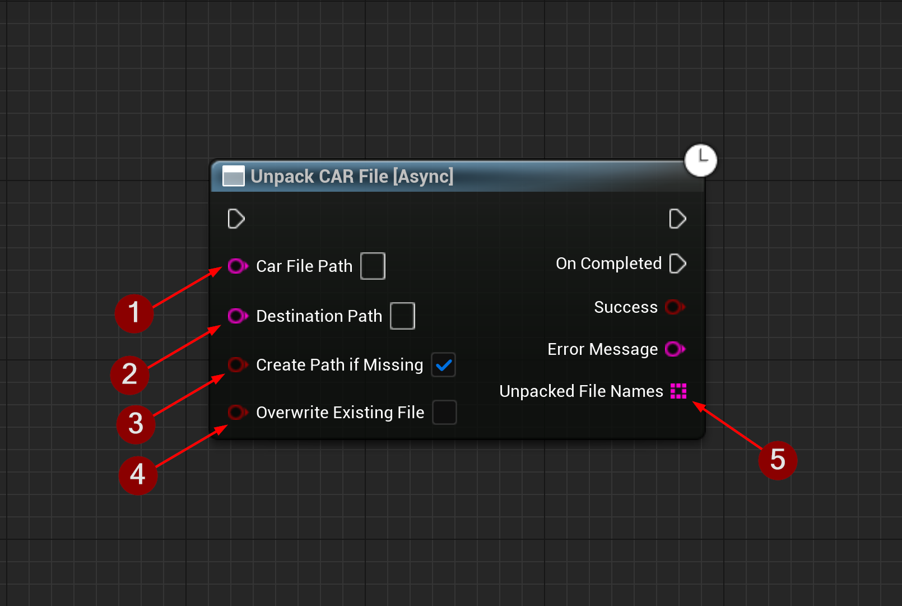

import {Step, Highlight} from '@site/src/lib/utils.mdx'

`Unpack CAR File` Unpacks all files contained in the specified `CAR` file to the destination path. This function
requires inputs as follows:

* `CAR File Path` <Step text="1"/> : Path to the `CAR` file.
* `Destination Path` <Step text="2"/> : Path to write the unpacked files to.
* `Create Path If Missing` <Step text="3"/> : Creates the destination path to where the unpacked files should be written to
if it is missing.
* `Overwrite Existing File` <Step text="4"/> : If set to false and the file exists this function will abort with failure.
Otherwise, an existing file will be overwritten.

If successful, returns a list of names for the unpacked files *Unpacked File Names* <Step text="5"/>.
