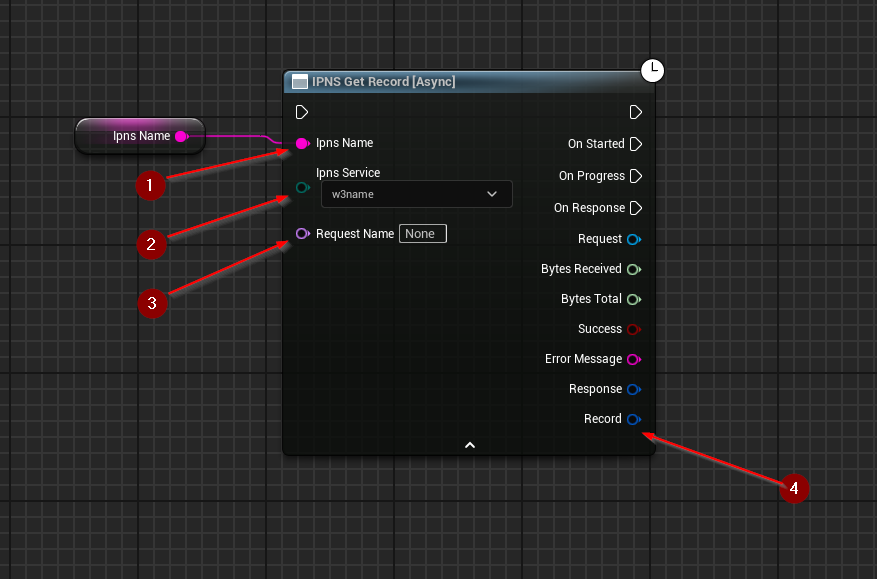

import {Step} from '@site/src/lib/utils.mdx'

## Get Record
`IPNS Get Record` Gets the record associated with a given IPNS name. This function requires inputs as follows:

* `Ipns Name` <Step text="1"/> : UTF-8 String, holds the **IPNS name** used to identify the requested record.
* `Ipns Service` <Step text="2"/> : Enum, the pinning service to send the request for record to.

There's also an optional input `Request Name` <Step text="3"/>, a unique identifier for the plugin's HTTP subsystem. It
allows to fetch the request by name. This is purely optional and only changes how the HTTP request will be managed
internally by the plugin.

The returned *Response* is a struct that holds data such as headers, status code, and body of the response of the HTTP
request.

:::info
If *Success* is *True* that only means that the response from the *IPFS* network was successful only.
:::

If successful, returns the *Record* <Step text="4"/> data structure.