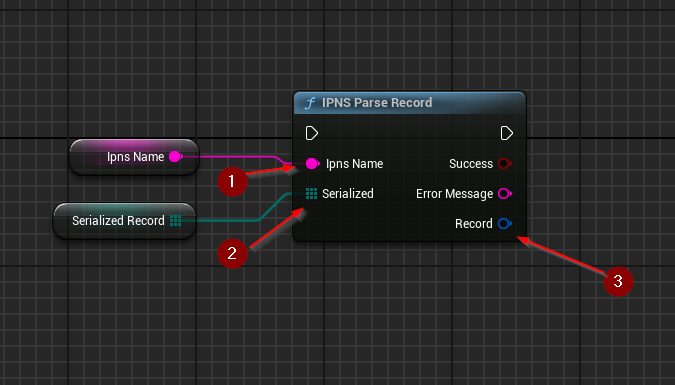

import {Step} from '@site/src/lib/utils.mdx'

## Parse Record
`IPNS Parse Record` Parses a given protobuf-encoded byte array into an IPNS record structure. This function requires
inputs as follows:

* `Ipns Name` <Step text="1"/> : UTF-8 String, holds the **IPNS name** associated with given record data.
* `Serialized` <Step text="2"/> : Byte array, the serialized IPNS record structure.

If successful, returns the *Record* <Step text="3"/> data structure.