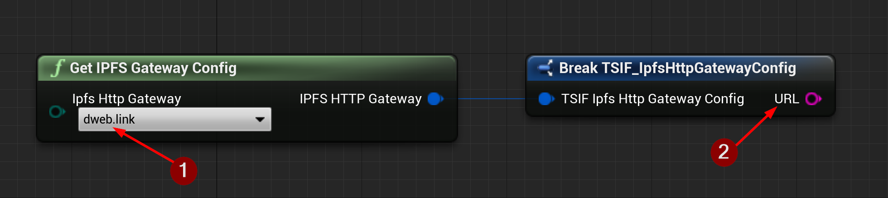

import {Step} from '@site/src/lib/utils.mdx'

## Get IPFS Gateway Config Function

`Get IPFS Gateway Config` is a helper function that holds default information for commonly used `IPFS` gateways <Step text="1"/>.

:::note
Additional gateways will be added in future updates if needed.
:::

This function returns a *Struct* that contains:
* <Step text="2"/> The gateway URL to send the Http requests to.

