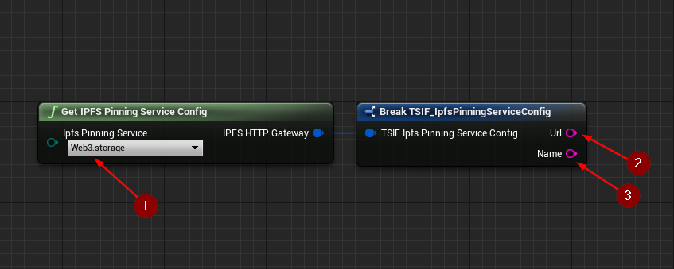

import {Step} from '@site/src/lib/utils.mdx'

## Get IPFS Pinning Service Config Function

`Get IPFS Pinning Service Config` is a helper function that holds default information for commonly used `IPFS`
pinning services <Step text="1"/>.

:::note
Additional pinning services will be added in future updates if needed.
:::

This function returns a *Struct* that contains:
* <Step text="2"/> The pinning service API endpoint URL.
* <Step text="3"/> The name of the pinning service API endpoint provider.

